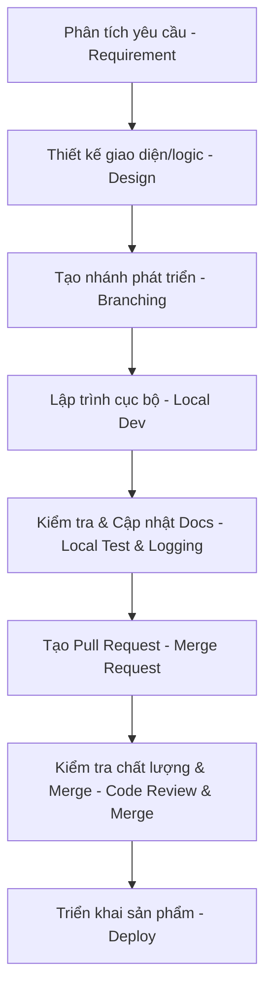

# Development & Git Workflow Standard

Để học tập cách làm việc chuyên nghiệp như trong dự án thực tế tại doanh nghiệp, dự án này tuân thủ các quy tắc nghiêm ngặt về phân nhánh Git, quy trình phát triển tính năng và quy chuẩn ghi chú lịch sử commit.

---

## 1. Quy trình Phát triển Tính năng (Feature Development Flow)

Mỗi thay đổi (thêm tính năng, sửa lỗi, chỉnh sửa tài liệu) đều đi qua các bước sau để đảm bảo chất lượng code và không làm hỏng nhánh chính:



---

## 2. Chiến lược Phân nhánh Git (Branching Strategy)

Dự án áp dụng mô hình phân nhánh chuẩn để cô lập các môi trường:

- **`main` (Production Branch):** Nhánh chính thức chạy ổn định trên Internet. Chỉ merge từ `develop` về khi đã hoàn tất kiểm tra chất lượng ở cuối mỗi Sprint.
- **`develop` (Integration Branch):** Nhánh tích hợp chính. Tất cả lập trình viên sẽ kéo code mới nhất từ đây để bắt đầu làm việc và merge các tính năng đã hoàn thành vào đây.
- **`feature/<tên-tính-năng>` (Feature Branch):** Các nhánh con được tạo từ `develop` để xử lý một công việc cụ thể (ví dụ: `feature/dark-mode`, `feature/sprint3-hero`, `fix/navbar-link-text`). Sau khi làm xong sẽ merge ngược về `develop`.

---

## 3. Quy chuẩn Commit Message (Conventional Commits)

Chúng ta tuân thủ quy chuẩn quốc tế để mọi lập trình viên hoặc AI khác đọc lịch sử git đều hiểu ngay thay đổi đó làm gì.

**Cú pháp tiêu chuẩn:**
```
<type>(<scope>): <mô tả ngắn gọn bằng tiếng Anh>
```

- **`feat`:** Tính năng mới (ví dụ: `feat(ui): add project filter buttons to projects grid`).
- **`fix`:** Sửa lỗi (ví dụ: `fix(nav): correct typo in projects link label`).
- **`docs`:** Chỉnh sửa hoặc thêm tài liệu (ví dụ: `docs(arch): rewrite system architecture for portfolio`).
- **`style`:** Các thay đổi không ảnh hưởng logic (format code, thêm khoảng trắng, chỉnh sửa CSS/SCSS thô).
- **`refactor`:** Thay đổi logic code nhưng không đổi tính năng hay sửa lỗi (tái cấu trúc code gọn hơn).
- **`chore`:** Cài đặt thư viện, cấu hình build, cấu hình ESLint, v.v. (ví dụ: `chore(deps): update react dependencies`).
- **`test`:** Bổ sung hoặc sửa đổi các file test.